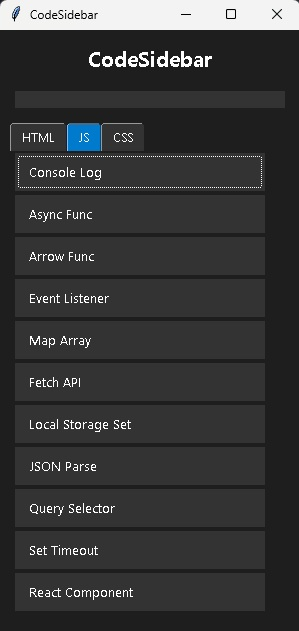

# CodeSidebar

A lightweight sidebar application for managing and pasting code snippets quickly.



## Features
- **Categorized Snippets**: Switch between HTML, JS, and CSS tabs.
- **Custom Snippets**: Add your own custom code snippets directly through the UI.
- **Persistent Storage**: Your custom snippets are saved locally and persist between sessions.
- **Instant Paste**: One-click to copy and paste directly into your active editor.
- **Search**: Quickly filter snippets by name across all categories.
- **Auto-Hide & Pin**: Automatically collapses to a thin bar when not in use. Hover to expand, or use "Pin Open" to keep it visible.

## Installation

### 1. Clone the repository
```bash
git clone https://github.com/DanielZmGt/CodeSidebar.git
cd CodeSidebar
```

### 2. Set up a Virtual Environment (Recommended)
**Windows:**
```bash
python -m venv venv
venv\Scripts\activate
```

**macOS/Linux:**
```bash
python3 -m venv venv
source venv/bin/activate
```

### 3. Install Dependencies
```bash
pip install -r requirements.txt
```

## Usage

### Windows
Double-click `Run_CodeSidebar.bat` or run:
```bash
python main.py
```

### macOS/Linux
Run the shell script:
```bash
chmod +x Run_CodeSidebar.sh
./Run_CodeSidebar.sh
```

## License
Distributed under the MIT License. See `LICENSE` for more information.